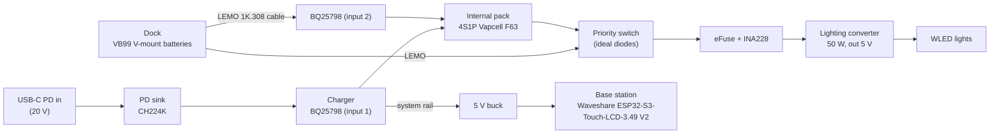

# Power system

Design for Nibbles' power: the internal battery in the pole base, the custom
power board, and the external battery dock. Status: **design agreed, no
hardware built yet.** Part choices are the current plan and still need
datasheet verification before layout. Numbers marked *estimate* should be
replaced with measurements once hardware exists.

## Goals

- The totem runs fully untethered on its internal pack (dancing in a crowd,
  no cable).
- Between sets or when moving between stages, a cable from a backpack dock
  plugs in to run the lights and recharge the internal pack at the same time.
- Plugging and unplugging never makes the lights flicker or reboot anything.
- At home or in a hotel, everything charges over USB-C PD.
- Every battery that travels stays under 100 Wh (airline carry-on limit).

## System overview

Three pieces of hardware:

| Piece | What it is | Code |
| --- | --- | --- |
| Base station | Existing Waveshare ESP32-S3-Touch-LCD-3.49 **V2** (screen, touch, main brain) | `firmware/base/` |
| Power board | New custom PCB in the pole base, next to the internal pack | none (read over I2C by the base) |
| Dock | New small PCB in a backpack enclosure holding VB99 batteries, with an ESP32-C3 | `firmware/dock/` (new) |

The Waveshare board stays as a display module for this iteration. A fully
integrated board (bare 172×640 AXS15231B panel on a custom PCB with an
ESP32-S3-WROOM-1-N16R8) is a possible later step.

## Loads and budget

| Load | Power | Notes |
| --- | --- | --- |
| Lighting converter | ~55 W max | 50 W output at ~90% efficiency; WLED averages far less |
| Internal pack charging | ~34 W standard, ~59 W quick | 2.0 A or 3.5 A at up to 16.8 V |
| Base station + power board | ~1–2 W | *estimate* |

Worst case over the dock cable is lights at full plus quick charging, around
**115 W**. Firmware caps this (see charge policy).

## Internal pack

- **4S1P Vapcell F63** (21700, 6250 mAh typical, 3.6 V nominal, 12.5 A max
  continuous, 2.0 A standard / 3.5 A quick charge, 2.5 V minimum, charge
  0–45 °C). Cells measure 21.6 × 71.0 mm, slightly larger than nominal 21700.
- Energy: 4 × 3.6 V × 6.25 Ah = **90 Wh**, about 80 Wh usable.
- Last year's pack used F60s (6000 mAh, otherwise the same ratings). **Never
  mix models, ages or batches inside one pack.**
- Untethered runtime *estimates*: 50 W ≈ 1.5 h, 30 W ≈ 2.5 h, 20 W ≈ 4 h.
- Needs a BMS with per-cell protection and balancing, rated 10 A or more, plus
  a pack fuse. Open decision: a separate 4S BMS board plus a BQ34Z100-G1
  gauge, or a BQ40Z50 (protection, balancing and gauge in one; needs TI tools
  to configure).
- Thermistor against the cells, wired to the charger's TS input, so charging
  slows or stops outside 0–45 °C (hot festival afternoons, sealed enclosure).

## Power board

### Charging (USB-C PD and dock)

- **PD sink: CH224K**, set to request **20 V only**. Ignore 28 V (EPR); it
  exceeds the charger's limit.
- **Charger: TI BQ25798.** 1–4S buck-boost with integrated FETs, NVDC power
  path, I2C control and ADC. Its dual-input selector takes USB-C on one input
  and the dock on the other, so the internal pack recharges from the VB99s
  with no extra circuitry.
- Everything on the high-voltage side rated **25 V or more**.
- With the Anker Prime 240 W, use port 1 and a **5 A e-marked cable**
  (100 W at 20 V; a standard 3 A cable limits it to 60 W).

### Lighting path

- **Priority switch:** ideal-diode controllers with enable pins (for example
  TI LM74700) choose the dock when present, otherwise the internal pack. The
  internal pack stays connected through its ideal diode at all times so it
  takes over instantly when the cable is pulled.
- Enough bulk capacitance on the converter input to bridge the switchover.
- **eFuse** on the lighting output (TI TPS2598x family or similar): soft start
  for the converter's input capacitors, current limit, short protection, and
  on/off control from the base.
- **INA228** on the lighting output: live voltage, current and power, used for
  runtime estimates and to measure the real average draw.
- **Lighting converter:** the current one needs 12–24 V in. Plan to replace it
  with a **9–36 V input** 5 V converter so it keeps working down to the VB99's
  11.2 V cutoff and through cable voltage drop. Until then, cut off at about
  13.0 V (internal pack) and switch dock batteries at about 12.5 V.

### Logic supply

- **5 V buck** from the system rail to power the Waveshare board (not an LDO;
  16.8 V to 5 V in an LDO wastes most of the power). Low quiescent current,
  since it is always on.
- Leave the Waveshare board's own battery header **empty** so its onboard
  charger does not fight this power system.

### PCB notes

- High-current path (up to ~9 A) on copper pours; consider 2 oz copper at
  JLCPCB.
- Give the BQ25798 copper area for heat (3–5 W while quick charging).
- XT30 for the internal pack connection.

## Dock

- Holds several **SmallRig VB99** V-mount batteries (4S, 14.54 V nominal,
  98.87 Wh, D-Tap/plate output up to 16.8 V at 10 A, 14 A on the Pro,
  cutoff 11.2 V). Check the exact model: VB99, VB99 SE and VB99 Pro differ.
- **Off-the-shelf V-mount plates** with wire leads, mounted in the enclosure.
- The dock does **not** charge the VB99s. They charge over their own USB-C
  from the Anker.
- **One battery at a time:** each slot has its own ideal diode and switch
  (rated 10 A or more). The dock drains one battery to its switchover
  voltage, then hands over to the next with no gap. Never parallel batteries
  directly.
- Charge level per slot is estimated from voltage (the VB99's internal gauge
  is not readable through the plate).
- Usable energy per VB99 *estimate*: ~90 Wh, about 1.5–1.7 h at 50 W.
- Fallback with no dock: VB99 models with a 100 W USB-C PD output can plug
  straight into the power board's USB-C input.

## Dock cable

LEMO 1K.308 (8 contacts, 5 A per contact, IP68 mated) with the existing
Kwangil **20 AWG** 8-conductor unshielded AWM 2464 cable, at least 2 m.

LEMO specifies 22 AWG maximum for these contacts. 20 AWG worked on last
year's cable; when building new ones, check for trimmed strands, stray strands
near neighbouring contacts, solid solder joints, heat-shrink on every contact
and good strain relief.

| Pin | Signal | Notes |
| --- | --- | --- |
| 1–3 | Battery + | ~2.6 A per pin at 115 W worst case |
| 4–6 | Ground | same |
| 7 | Data | single-wire UART, dock ↔ base (same idea as the eye cable) |
| 8 | Dock detect / enable | see hot-plug rules |

Voltage drop *estimate* at 2 m: about 0.3 V at 55 W, about 0.5 V at 95 W.
If a shielded cable is ever used, bond the shield to the LEMO shell at the
base end only and never carry current on it.

### Hot-plug rules

1. The dock keeps its output **off** until it sees dock detect and the base
   tells it to turn on; the eFuse ramps the output up gently. The contacts
   never make or break under load.
2. The base sends a regular heartbeat over the data line. If the dock misses
   it, it turns its output off. (All LEMO contacts separate at nearly the same
   moment, so dock detect alone is not enough.)
3. The internal pack's ideal diode covers the gap whenever external power
   disappears.

### Mechanical

- LEMO push-pull plugs release only by the sleeve, not by pulling the cable.
  Add a strain-relief clip near the totem end and anchor the cable to a
  backpack strap so a snag pulls on the anchor, not the connector.
- LEMO blanking cap on the totem receptacle when unplugged (IP68 applies only
  when mated).

## I2C and GPIO

The power board gets its **own I2C bus** on the S3's second I2C controller.
The Waveshare board's existing bus carries touch, IMU (QMI8658), RTC
(PCF85063) and the I/O expander, and the QMI8658 may sit at 0x6B, which is
the BQ25798's fixed address. A separate bus also keeps a cable fault from
taking down the touchscreen.

| Device | Address |
| --- | --- |
| BQ25798 | 0x6B (fixed) |
| INA228 | 0x40–0x4F (set by pins) |
| BQ34Z100-G1 (if used) | 0x55 |

GPIOs needed on the Waveshare V2 board, about 5 in total:

| Function | Count |
| --- | --- |
| Power I2C (SDA, SCL) | 2 |
| Dock UART (single wire) | 1 |
| Dock detect / enable | 1 |
| BQ25798 interrupt | 1 |

**TODO:** check the V2 pin map against what `firmware/base` already uses and
pick free pins. V2 swapped LCD_TE/LCD_RESET and LCD_BL/EXIO_INT compared to
V1, so use V2 references only.

## Firmware responsibilities

### Base (`firmware/base`)

- Read BQ25798, gauge and INA228 over the power I2C bus.
- Run the charge policy and write the charger's input current and charge
  current limits.
- Lead the dock link: heartbeat, output enable, read slot status.
- Show pack, dock and load status on the screen; broadcast battery telemetry
  over `nibbles_link` so the eyes and WLED can react (for example lowering
  brightness when the pack is low).
- Optionally lower WLED's brightness limit as the internal pack drops, to
  stretch untethered runtime.

### Dock (`firmware/dock`, ESP32-C3, ESP-IDF 5.5.5)

- Measure each slot's voltage; choose the active slot; hand over at the
  switchover voltage.
- Keep the output off until enabled; turn it off if the heartbeat stops.
- Report slot voltages, active slot, output state and faults.

### Shared protocol (`shared/nibbles_link`)

Dock messages go here, per the repo convention (anything more than one board
must agree on). Proposed messages:

- `DockStatus`: per-slot voltage and present flag, active slot, output state,
  fault flags.
- `DockCommand`: output enable/disable, switchover voltage.
- `Heartbeat`: from base to dock, with a timeout the dock enforces.

## Charge policy (proposal)

Charge from the dock fast when the active VB99 is healthy, and back off as it
empties to limit cable current, cable heat and strain on the VB99.

| Active VB99 voltage | Internal pack charge current |
| --- | --- |
| above 14.0 V | 3.5 A (quick) |
| 13.0–14.0 V | 2.0 A |
| 12.0–13.0 V | 1.0 A |
| below 12.0 V | 0 (lights only) |

Also cap total input power at about 95 W, and let the thermistor override
everything. Thresholds are starting points to tune on real hardware. Over
USB-C, charge at the rate the PD source allows, up to 3.5 A.

## Open decisions

- Internal pack BMS and gauge: separate BMS + BQ34Z100-G1, or BQ40Z50.
- Wide-input (9–36 V) lighting converter: which part.
- Exact VB99 model(s) in use and their output ratings.
- Number of dock slots.
- Free GPIOs on the Waveshare V2 board.

## Travel notes

- Internal pack ~90 Wh, VB99 98.87 Wh: both under 100 Wh.
- Spares in carry-on only, terminals covered. Label the internal pack's Wh.
- Many airlines limit spare batteries per passenger; check before flying
  with many VB99s.
